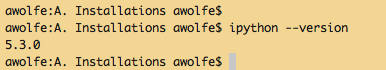
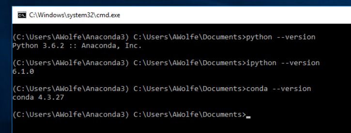
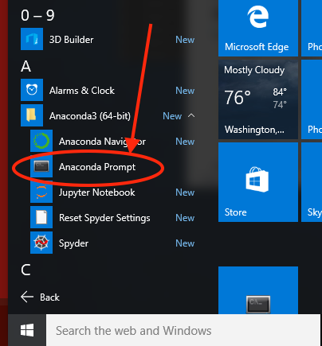

# Assignment 2 - Part A: Installations
We will install a bunch of stuff here so that you can use it for ETL in Part B.
We will go through the _Python for Data Analysis_, 2nd Ed instructions from page 42.  We will install:

* git
* Anaconda Python
* IPython
* Jupyter
* PyCharm
* GitHub Desktop
 
##*PLEASE TAKE SCREEN SHOTS OF EACH STEP AND SAVE THEM IN THE "Put your screen shots here!" SUBDIRECTORY*

You will be handing these in via GitHub.  More later.

## Install Git version control

Git is a version-control system that we will use to share files, in addition to our use of the Google Drive.

You can download git from [https://git-scm.com/download/](https://git-scm.com/download/).  The installer is pretty easy.

You will have received an invitation from me to use our GitHub repository.  You need to accept that invitation and create an account.

We will be using GitHub as our repository.

## Install Anaconda Python

You can go to [http://continuum.io](http://continuum.io) and it will take you to [https://www.anaconda.com](https://www.anaconda.com) and it looks like they are trying to sell you something.  They are, but you don't need to buy anything, just go to the [Downloads Page](http://www.anaconda.com/download).  Be sure you download _for Python 3.6 or later_.

The installers are pretty straightforward.

When you have finished the install, you should be able to simply run python.  I always want to verify the version.  Here's way to verify both:

## Make Sure IPython is Installed
The _ipython_ command takes --version, too:

Here's how it is on Windows:

## Note on Anaconda on Windows - Anaconda Prompt

When you install Anaconda on Windows, it suggests you _not_ set the Windows PATH for anaconda python.  I think that this is probably good advice, but in this case it makes it harder to run the Anaconda binaries and Jupyter. There is a way to ease this, and it's very Windows-y.  While programmers might expect to pop up a command-line prompt, don't use just any command line.  Go to the Anaconda program group and run Anaconda Prompt instead.  *(Suggestion: pin to Taskbar)*

## *Anaconda Navigator - Just say no!*

The Anaconda package includes a boatload of features, including a monster called "Anaconda Navigator."  This goes way beyond anything we need or want. _Don't_ launch it.

##GitHub Desktop

GitHub has its own graphical client called GitHub Desktop. Especially if you are new to Git, you download the GitHub Desktop for your computer from [https://desktop.github.com](https://desktop.github.com).

#*You may now proceed to part A.2*
