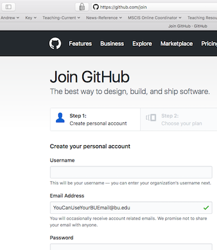
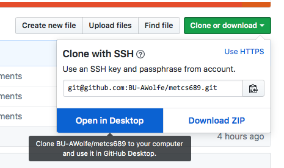

# Getting Started with Git
As mentioned before, you will be submitting your assignments through the Git version control system using a server called 'GitHub Classroom.

A majority of assignment materials are on GitHub with initial code and such.

Let's start by getting you connected to GitHub.

## Accepting your GitHub Classroom Invite

I have (tried?) to send invitations to all of you with our GitHub classroom.  These will all end up getting you to a URL like [https://classroom.github.com/classrooms/32312826-bu-met-cs-689](https://classroom.github.com/classrooms/32312826-bu-met-cs-689].  However, the actual invitation URL from GitHub is [https://classroom.github.com/a/qzz1XX6M](https://classroom.github.com/a/qzz1XX6M)

The initial steps will use [http://classroom.github.com](http://classroom.github.com).  Classroom is a github 'application' and so it needs ... well, you'll see.  However, after this is done you only need to use the regular [https://github.com](https://github.com).

When you try to join the classroom, you'll be asked to sign in or create a GitHub account:

You will need a GitHub account for your use in this class.  If you have one already, especially on your BU email, feel free to use it for this class and just log in.  

## Create a GitHub Account

If you don't have a GitHub account or would prefer using a new one, go ahead and create account.  You should sign up at [https://github.com/join](https://github.com/join).

After you enter your information, you will get a confirmation page like this

Just use the free account.  After this you will get a page asking you to verify your email to continue:

## Verify your Email

As with other systems, you can only verify your email by actually receiving your email.  You will get a message like this:

Click the link to verify...

## Re-browse to GitHub Classroom and Authorize

[https://classroom.github.com/a/qzz1XX6M](https://classroom.github.com/a/qzz1XX6M)

You will now be told to authorize your account...  If you don't, this will be a short and not very successful class for you!

## Going to your repository involves a copy

The term "repository" is what the Git version control system calls a set of files and directories and versions.  There is a set of files and directories on GitHub for this assignment (and others!).  When you click on the link ("Your assignment... here.."), it gives you an online personal repository that is a copy of the main class repository.  It will go to a screen that says "Preparing your new repository."

## Finally, your copy of the class repository!!

Sometimes this screen concludes and takes you to your new repository automatically.  Once I left it there for 15 minutes and it did nothing.  Otherwise, (re-) open your browser to [https://GitHub.com](GitHub) and log in.  Then go to the class repository **metcs689**.

### If you're already comfy with Git, just clone and go to step A.3.

Git newbies, continue...

## Get ("clone") Files from GitHub

Now you have to get the files onto your own computer so that you can work with them.  With *git*, the process of copying the files is called "cloning."  When you *clone*, you are not just copying the files, you are copying the entire version history. This sounds very bulky until you realize that the only significant changes are little text files - our whole repository is smaller than two songs on a CD.

You will see the green button on the right that says "Clone or Download."  If you click it, you will actually get a few distinct options as part of "Clone or Download":
 

Do not download the files as a ZIP, because this will block you from re-uploading cleanly.  If you're familiar with Git, please feel free to clone in whatever way you wish.  If not, make sure you have GitHub Desktop installed, then choose the "Open in Desktop" option.

It does not matter where you put it, but you want it to be easily accessible from your Python/Anaconda shell.

If you download with GitHub, it will show you a completely inscrutable window with a few empty panels.  All the "empty" means is that you have made no changes yet.  But how do you verify that anything happened at all?

This is a Windows shot, but it's almost the same on MacOS.  Click on **open this repository** in Explorer/Finder and you will see all the files you downloaded:

**You can make as many clones as you like.  They cannot damage each other or your main repository on GitHub.  It will only be confusing!**

If you feel like it, go ahead and copy/clone a few more times!  You can delete your repository directories and re-clone however you like.

Of course, once you've started modifying files in one of your repositories, then you won't want to delete it!  We'll deal with that later.

## One last note...

In Windows, if you right-click in your Explorer window, you will likely see two Git submenus like this:

You can use the "Git GUI Here" if you like - all the Git tools work the same.  However, for simplicity's sake a Git newbie should probably stick with the GitHub Desktop.

*Do not use the "Git Bash Here" operation.*  This present a Linux-like command window ("bash") rather than the Windows command prompt, which might be totally foreign to a Windows users.  Worse, however, *it does not have the setup you need to use Python*.

#*You may now proceed to part A.3*
