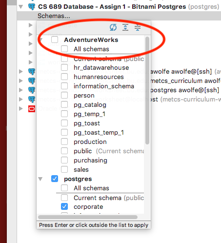

# Assignment 3 - Dimensional Data Modeling

Dimensional Data Modeling is crucial to data warehousing.

In this assignment we will do some data warehousing on the Microsoft AdventureWorks database.

Write up a report for this lab in a Microsoft Word or other word-processing document.  You will submit this as part of the assignment.

You will also write new SQL commands and save these into your "Assignment 3 - Dimensional Data Modeling" directory, then commit and push to GitHub.

## Download new PG-Bitnami for 'PG-Bitnami for CS 689 Dimensional Modeling Lab' appliance

On the class Google Drive, look in the "Virtual Machine Appliances Here" folder.  You will find a third version of the PostgreSQL database, named `PG-Bitnami for CS 689 Dimensional Modeling Lab.ova`.  Download this appliance and import it into VirtualBox.

### Connect using DataGrip

Please make sure that this appliance is the only one running.

You connect the same as the other appliance, except this is accessible via port 56321, rather than the other port.

When you connect, you may see the database called "AdventureWorks" immediately.  However, you are more likely to see your existing database and schemas like this:

Assuming this is necessary, you should select and then double-click the "Schemas... link"

 

You will see that AdventureWorks is there:

It's easiest to select "All Schemas," but the ones you are interested are only:

* hr_datawarehouse
* humanresources
* person
* production
* purchasing
* sales

Open up the "person" schema and look at the "businessentity" table.

## Install New Dimensional Database

Open a "console" for the database and verify it by running a simple query:

`select count (*) from humanresources.employee`

Next, open up (into DataGrip) all of the sql files under the "Assignment 3 - Dimensional Data Modeling" folder:

* calendar_dimension.table.pg.sql
* department_dimension.table.pg.sql
* elapsed\_days_dimension.table.pg.sql
* employee_dimension.table.pg.sql
* location_dimension.table.pg.sql
* pay\_change_facts.table.pg.sql
* vjobcandidateeducation.view.pg.sql
* when\_are\_there\_pay_changes.sql

Run the script vjobcandidateeducation.view.pg.sql first.

Next, run all of the six 'table.pg.sql' scripts; you need only ensure that you run the 'location' and then 'pay\_change_facts' scripts after the other four.

You should now have a mini data warehouse in the **hr_datawarehouse** schema.

## What is "ELAPSED\_DAYS_DIMENSION"?

This is a type of dimension that is based on date-time, but not on the calendar - it's based on date-time *intervals*, not absolute dates.  To make calculations for each employee based on how long since employment, we certainly can't use an absolute date...

Explain this dimension in your report.

## How did we build the pay\_change_facts table?

Examine the sql in **pay\_change_facts.table.pg.sql**.  How did it refer to each dimension?

Write a paragraph in your document describing this and anything else you find interesting about the creation of the dimensional warehouse.

## Explore the timing of employee pay changes

Run each query in the script **when\_are\_there\_pay_changes.sql**.  Examine the results.  What do the queries tell us about pay changes?

Write these up in your report.

